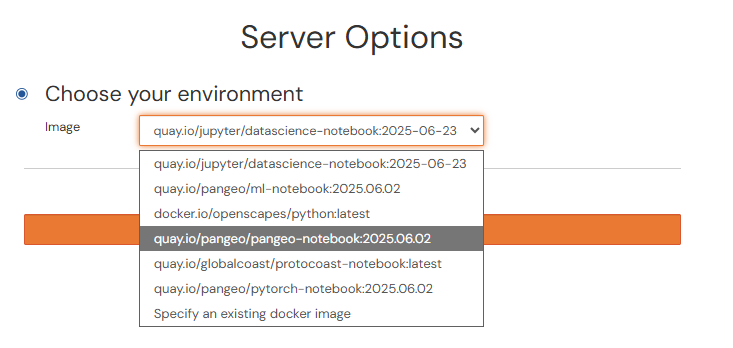
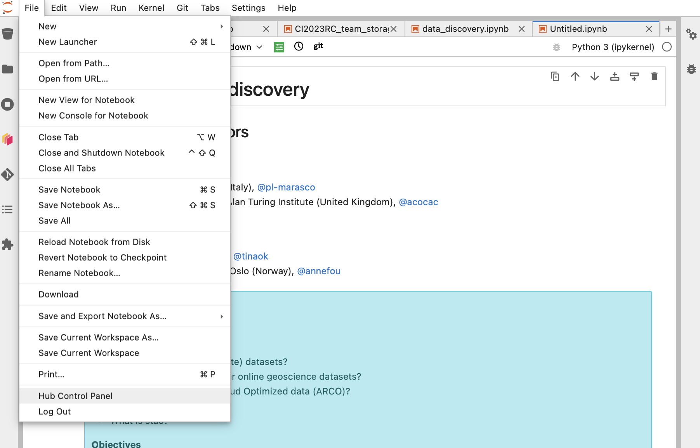

# Users: How to join pangeo-eosc?

In this section you will learn how to register and access pange-eosc services.

Let's start with a bit of background information! The cloud resources for pangeo-eosc are provided through the collaboration between the [Pangeo community](https://pangeo.io), the [EGI-ACE project](https://www.egi.eu/project/egi-ace/), and the [C-SCALE project](https://c-scale.eu) within the [European Open Science Cloud](https://eosc-portal.eu/about/eosc) framework.

## Background information

### The European Open Science Cloud (EOSC)

The [European Open Science Cloud (EOSC)](https://eosc-portal.eu/about/eosc) aims at becoming the main environment for hosting and processing research data to support European Science. 

### Pangeo Europe 

</a>

[Pangeo](https://pangeo.io/) is a worldwide community for Big Data geoscience promoting open, reproducible, and scalable science. 

[Pangeo Europe](https://pangeo.io/meeting-notes.html) aims at highlighting European contributions to the Pangeo Community and at providing a reference deployment for Pangeo on EOSC. 
The Pangeo deployment on EOSC has been made possible thanks to [CESNET](https://www.cesnet.cz/?lang=en) in the context of the [C-SCALE](https://c-scale.eu) project.

### C-SCALE

The H2020 [Copernicus-eoSC Analytics Engine (C-SCALE)](https://c-scale.eu) project provides European researchers with a federated Earth Observation (EO) data analytics platform by leveraging the best-of-breed tools and services of pan-European e-infrastructures. C-SCALE delivers a seamless user experience by abstracting away the complexity of resource provisioning and orchestration. The project offers three main services: the Federated Earth System Simulation and Data Processing Platform (FedEarthData), the Earth Observation Metadata Query Service (EO-MQS), and the openEO Platform service. [FedEarthData](https://c-scale.eu/fedearthdata/) provides a distributed infrastructure of data and compute providers to support the execution of EO workflows at scale, while the [EO-MQS](https://c-scale.eu/eo-mqs/) makes Copernicus data distributed across partners discoverable and searchable. Finally, the [openEO platform](https://c-scale.eu/openeo-platform/) simplifies processing and data management by offering intuitive programming libraries alongside a large EO data repository.

## Register and setup to Cloud EGI JupyterHub

To facilitate the reproducibility of the papers, CI2023 reproducibility challenge provides you with a ready-to-use JupyterHub with 4 flavors: 
- Pangeo Notebook;
- Machine Learning Pangeo notebook with GPU-enabled tensorflow2;
- Machine learning Pangeo notebook with GPU-enabled pytorch;
- Datascience Notebook with Python, R and Julia.

We will give more details about these 4 flavors but first, let's go through the registration process.

The JupyterHub platform was deployed and provided on top of EOSC federation thanks to provider CESNET. 

We recommend using the EOSC/CESNET infrastructure (called later Cloud EGI JupyterHub) to speed-up your work and facilitate sharing among participants.

### Registration

First, as early as possible (ideally before the start of the CI2023 reproducibility challenge), all the participants will have to create an EGI account and enroll to the `vo.pangeo.eu` Virtual Organisation to have access to Cloud EGI JupyterHub.

There are several steps to follow:

1. Sign up for an EGI account on the **development instance** of EGI Check-In, clicking on: [https://aai-dev.egi.eu/registry/co_petitions/start/coef:2](https://aai-dev.egi.eu/registry/co_petitions/start/coef:2). **Use your [ORCID iD](https://orcid.org/) account to authenticate.**
2. **Enroll** in the `vo.pangeo.eu` Virtual Organisation (VO) by clicking on: [https://aai-dev.egi.eu/registry/co_petitions/start/coef:290](https://aai-dev.egi.eu/registry/co_petitions/start/coef:290). Review and click on `Submit`. Please add a note: "I am participating in the CI2023 reproducibility challenge", in the statement of purpose when requesting to join the VO. Once your enrollment has been validated you will have access to [https://repro-challenge.vm.fedcloud.eu/](https://repro-challenge.vm.fedcloud.eu/) (it requires you to authenticate using EGI Check-in credentials e.g. your ORCID iD). 

:::{note}
It is **important** to perform all these steps **as early as possible** in order for managers of the Virtual Organisations to approve your petitions to join (which may **take several days**).
:::

Once your enrollments have been validated, you may need to log out from EGI Check-in to refresh your account. If you have any trouble, request help by [filling an issue](https://github.com/eds-book/reproducibility-challenge-2023/issues/new). Someone will assist you with the setup.

### Cloud EGI JupyterHub flavors

To access the cloud EGI JupyterHub, you need to click on [this link](https://repro-challenge.vm.fedcloud.eu/) and choose among the 4 available flavors (as shown on the figure below):

The choice between the 4 flavors depends on the paper you are trying to reproduce. Please note that you can also change from one flavor to another by stopping your server and starting it again.

- Pangeo Notebook uses a docker image maintained by the Pangeo community. It contains all the Python packages you need to data analysis and visualization. The list of packages and all the Pangeo Notebook environment is made available [here](https://github.com/pangeo-data/pangeo-docker-images); look up the `pangeo-notebook` folder. 
- Machine Learning Pangeo notebook with GPU enable tensorflow2: similarly, it is maintained by the Pangeo community and the complete computational environment with the list of Python packages is also available at [https://github.com/pangeo-data/pangeo-docker-images](https://github.com/pangeo-data/pangeo-docker-images) in the `ml-notebook` folder. This flavor contains all the packages from the Pangeo Notebook flavor and is GPU-enabled tensorflow2. Choose this flavor if you need GPUs; for instance for training neural networks;
- Machine Learning Pangeo notebook with GPU enable pytorch: it is the same as `ml-notebook` but with GPU-enabled pytorch. Select this flavor if you wish/need to use pytorch for reproducing the selected paper;
- Datascience Notebook with Python, R and Julia is maintained by the Jupyter community at [https://github.com/jupyter/docker-stacks](https://github.com/jupyter/docker-stacks). Look up the `datascience-notebook` folder. It contains 3 different kernels, namely Python, R and Julia notebooks. You should prefer this flavor if the paper you reproduce uses R or Julia programming language. Please note that you would probably need to add additional packages as the list of available packages is not exhaustive and specific to environmental data science.

With all the 4 flavors, you can also add additional packages you may need for reproducing the paper of interest.

For the Pangeo and Machine Learning notebook flavors, a Dask-gateway is available for scaling your computation. For more details on this deployment, you may want to take a look at [Daskhub helm chart](https://github.com/dask/helm-chart/tree/main/daskhub).

:::{note}
To save resources and reduce the energy footprint of the reproducibility challenge, we kindly ask you to shutdown and close your JupyterHub at the end of your day. First select "Hub Control Panel" in the File Tab:

 and then click on "Stop My Server" as shown on the figure below:

:::

From there, you can open and execute any notebooks used during the workshop, enjoy 🚀!

### EGI MinIO Object Storage

Each user has a very small amount of local storage when using the Cloud EGI JupyterHub but it is not meant to be used for storing large data. 
As part of the infrastructure provided by CESNET in the context of C-SCALE, dedicated [MinIO Object storage](https://min.io) has been setup for the reproducible challenge.

The MinIO console endpoint is: [https://repro-challenge-minio.vm.fedcloud.eu/](https://repro-challenge-minio.vm.fedcloud.eu/). You can authenticate to the MinIO Object Storage in the same way you login to the Cloud EGI JupyterHub. As shown on the Figure below, make sure you "Select Other Authentication Method" and "Login with SSO (checkin)" to access the MinIO console. Then use your ORCID iD to login.

You can create, access and manage your buckets from the minIO console (or use [minIO Python package](https://min.io/docs/minio/linux/developers/python/minio-py.html)). The figure below shows the GUI (with several tabs on the left; the bucket tab is selected on the figure): initially, you won't have any buckets and for instance, you can create public/privates buckets. To share data within your team, you can create a public bucket or provide anonymous access to everyone (read-only) to your bucket. **Keep your access keys private and do not share them to anyone**. More detailed recommendation on how to use the EGI MinIO Object Storage for the reproducibility challenge can be found at [Workflow for a Notebook Project](https://eds-book.github.io/reproducibility-challenge-2023/teams/workflow.html).

:::{note}
After the CI2023 reproducibility challenge, you can continue to use the resources to finalize the Jupyter Notebook to be published in the [EDS Book](https://edsbook.org), but note that we would probably modify the service and things might not work from time to time. The link (web address) to the Cloud EGI JupyterHub may change too. **Therefore, we recommend you to copy all the necessary files before; for instance in the Github repository set up for reproducing your paper**.
We would appreciate you get in touch with us to give us some feedback and be informed of the platform evolution. You can do this through [Github Discussions](https://github.com/eds-book/reproducibility-challenge-2023/discussions).

You can also contribute to "the Pangeo show and tell" online meetups.
:::

# Local Dockerised Environments
TBD
